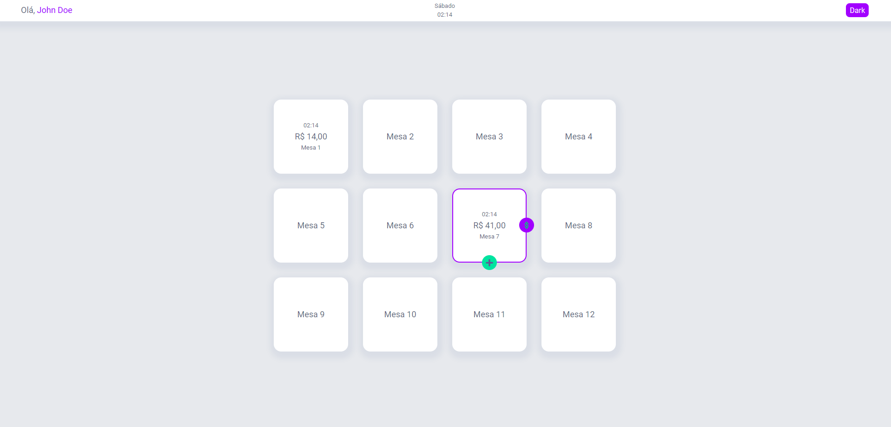
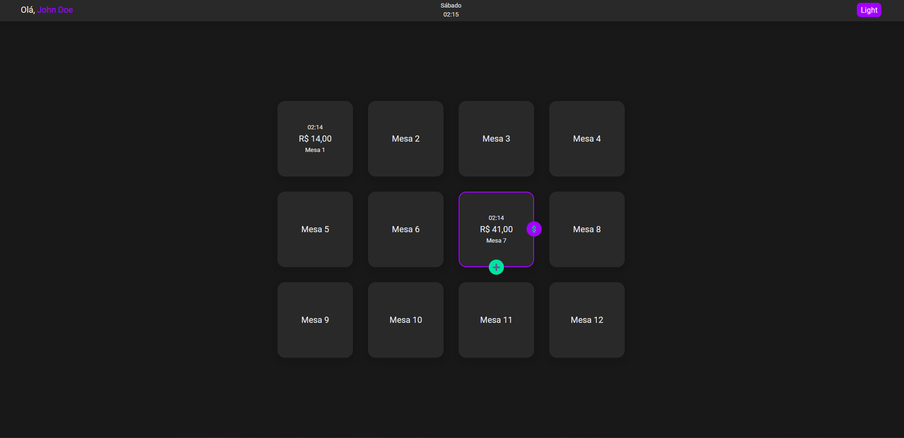
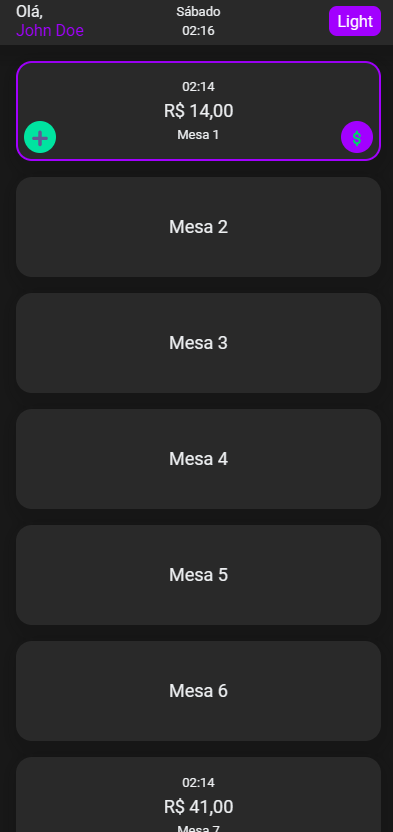

# Restaurant App 🍽️

App to control client spending on restaurant

## Screenshots





## Stack

- Vue 3 (usando sintaxe similar ao Vue 2.7)
- Typescript
- SCSS
- Pinia
- Vite
- Vitest
- Testing Library
- Faker.js

## Running Local

```
npm install

yarn
```

```
npm run dev

yarn dev
```
